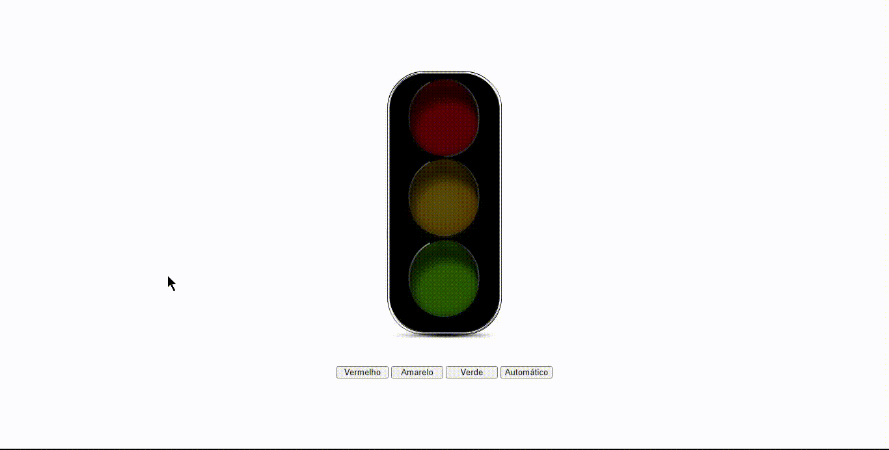

<h1 align="center">
    
</h1>

  

###  Sobre

**Semáforo**: São três imagens, quando você apertar o botão vermelho, o semáforo vai fica vermelho, apertando o botão amarelo o semáforo fica amarelo e... Quando você apertar o botão automatico, ele vai fica trocando de cor (imagens) automaticamente 

---
 
### 💻 Tecnologia utilizada

- HTML 5
- CSS 3
- JAVASCRIPT

---
